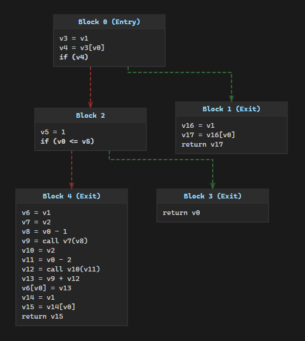

# mallow

[](https://www.gnu.org/licenses/agpl-3.0)

a [Luau](https://luau.org) bytecode disassembler and decompiler.

> **Note:** only Luau bytecode versions 5 through 9 are supported.

## Features

- **disassembly** - dump raw IL instructions for manual analysis
- **decompilation** - reconstruct readable Luau source from bytecode
- **control flow graphs** - interactive HTML visualizations (optional feature flag)

## Example

Input (`fib.luau`):

```luau
local memo: {number} = {}

local fib: (number) -> number
fib = function(n: number)
    if memo[n] then
        return memo[n]
    end
    if n <= 1 then
        return n
    end
    memo[n] = fib(n - 1) + fib(n - 2)
    return memo[n]
end

print(fib(24))
```

Decompiled output:

```luau
-- Decompiled by mallow 0.3.2

local v0 = {}
local v1 = nil
local v2
v2 = function(p0)
    -- proto 0: upvalues = [v0, v2]
    if v0[p0] then
        return v0[p0]
    elseif p0 <= 1 then
        return p0
    else
        v0[p0] = v2(p0 - 1) + v2(p0 - 2)
        return v0[p0]
    end
end
print(v2(24))
return
```

Control flow graph of the inner closure:



## Building

Requires Cargo and Rust 1.95+.

```sh
cargo build --release
```

To include CFG visualization support:

```sh
cargo build --release --features visualize
```

To let the development `roundtrip` command download and cache verified Luau releases:

```sh
cargo build --release -p mallow-cli --features luau-toolchain
```

Binary lands at `target/release/mallow`.

## Usage

**disassemble** - dump the raw instruction stream:

```sh
mallow disasm -i <bytecode>
```

**decompile** - reconstruct source from bytecode:

```sh
mallow decompile -i <bytecode>
```

Pass `--emit=ssa` to emit regioned SSA with its original symbol IDs instead of cleaned source:

```sh
mallow decompile -i <bytecode> --emit=ssa
```

**roundtrip** - compile a `.luau` file then immediately decompile it. Without the `luau-toolchain` feature, this requires `luau-compile` in PATH:

```sh
mallow roundtrip -i <source.luau>
```

With the `luau-toolchain` feature, an exact Luau release or the newest release for a bytecode version can be selected explicitly. Without either selector, roundtrip still uses `luau-compile` from PATH:

```sh
mallow roundtrip -i <source.luau> --luau-release 0.650
mallow roundtrip -i <source.luau> --luau-bytecode 8
```

The same SSA output is available after compilation:

```sh
mallow roundtrip -i <source.luau> --emit=ssa
```

**visualize** - generate an interactive CFG as HTML (requires `--features visualize`):

```sh
mallow visualize -i <bytecode> -o <output.html>
```

### Type Inference

Luau by default does not include any type info in the bytecode, unless compiled with the `-t1` flag. `-O2` may keep some function param types, if the compiler deems them beneficial to the runtime; but those are can only be trivial types, like `number` or `string` - no unions, named userdata, table types etc.

mallow has a custom type inference engine, that recovers both factual bytecode types (if present), and non-trivial types that can't be inferred naturally by native tools like `luau-analyze` or various LSPs. Due to the inherent nature of this indeterminable problem, this is gated behind a `--infer-types` flag. This flag can only be used with the `decompile` or `roundtrip` command.

Example output with type inference (`fib.luau`):

```luau
[TODO]
```

## Testing

Tests live in `tests/cases`. Each case is compiled with the Luau compiler, decompiled, and both versions are executed - stdout is compared for semantic equivalence rather than source text matching. Before running tests, make sure your compiler version emits a supported bytecode version.

> **Note:** Testing mallow requires both the `luau` and `luau-compile` binaries in PATH.

```sh
cargo test
```

To test the "real world" reliability of mallow, integration tests are using real open source Lua/Luau scripts. Their authors and licenses can be found in the [third party notices](THIRD_PARTY_NOTICES) file.
