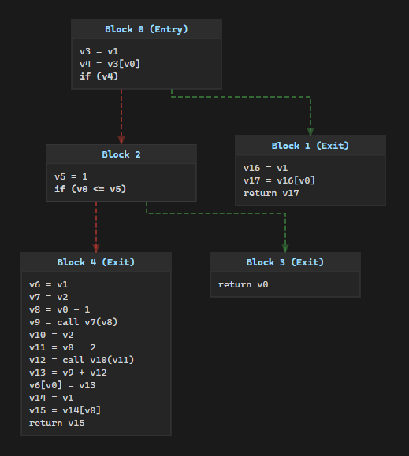

# mallow

[](https://www.gnu.org/licenses/agpl-3.0)

a [Luau](https://luau.org) bytecode disassembler, decompiler and toolchain.

> **Note:** only Luau bytecode versions 5 through 9 are supported.

## Features

- **disassembly** - dump raw IL instructions for manual analysis
- **decompilation** - reconstruct readable Luau source from bytecode
- **control flow graphs** - interactive HTML visualizations (optional feature flag)

## Example

Input (`fib.luau`):

```luau
local memo: {number} = {}

local function fib(n: number)
    if memo[n] then
        return memo[n]
    end
    if n <= 1 then
        return n
    end
    memo[n] = fib(n - 1) + fib(n - 2)
    return memo[n]
end

print(fib(24))
```

Decompiled output:

```luau
-- Decompiled with mallow 0.5.0
local v2
local v0 = {}
local v1 = nil
v2 = function(p0: number)
    if v0[p0] then
        return v0[p0]
    elseif p0 <= 1 then
        return p0
    else
        v0[p0] = v2(p0 - 1) + v2(p0 - 2)
        return v0[p0]
    end
end
print(v2(24))
local v3 = v2
return
```

Control flow graph of the inner closure:



## Building

Requires Cargo and Rust 1.95+.

```sh
cargo build --release
```

To include CFG visualization support:

```sh
cargo build --release --features visualize
```

To build in the managed Luau toolchain, a development utility that downloads and caches verified Luau releases:

```sh
cargo build --release -p mallow-cli --features luau-toolchain
```

Binary lands at `target/release/mallow`.

## Usage

Every command takes either bytecode or Luau source. Files ending in `.luau` or `.lua` are compiled with `luau-compile` from PATH first; anything else is read as bytecode. Pass `--input-kind source` or `--input-kind bytecode` to override this. Compiler options (`-O`, `-g`, `-t`) apply to source input only.

**disassemble** - dump the raw instruction stream:

```sh
mallow disasm <bytecode>
mallow disasm <source.luau>
```

**decompile** - reconstruct source from bytecode:

```sh
mallow decompile <bytecode>
mallow decompile <source.luau>
```

Pass `--emit=ir` to emit flat intermediate representation instead of cleaned source:

```sh
mallow decompile <bytecode> --emit=ir
```

**visualize** - generate an interactive CFG as HTML (requires `--features visualize`):

```sh
mallow visualize <bytecode> -o <output.html>
```

### Managed Luau toolchain

With the `luau-toolchain` feature, `--luau` compiles source input with a managed release instead of `luau-compile` from PATH. It accepts an exact release, or `bc<N>` for the newest release emitting bytecode version `N`:

```sh
mallow decompile <source.luau> --luau 0.650
mallow disasm <source.luau> --luau bc8
```

The `toolchain` command manages the cached releases and runs their tools:

```sh
mallow toolchain list [--bytecode 8] [--all]
mallow toolchain install bc6 0.700
mallow toolchain uninstall 0.700
mallow toolchain path bc6 --tool compile
mallow toolchain run bc6 compile -- --text <source.luau>
mallow toolchain prune
```

### Using just

Commands can get quite verbose, so running them with [just](https://github.com/casey/just) is preferred during development. See: [justfile](justfile).

## Testing

Tests live in `tests/cases`. Each case is compiled with the Luau compiler, decompiled, and both versions are executed - stdout is compared for semantic equivalence rather than source text matching. Before running tests, make sure your compiler version emits a supported bytecode version.

```sh
cargo test
```

To test the "real world" reliability of mallow, integration tests are using real open source Lua/Luau scripts. Their authors and licenses can be found in the [third party notices](THIRD_PARTY_NOTICES) file.
